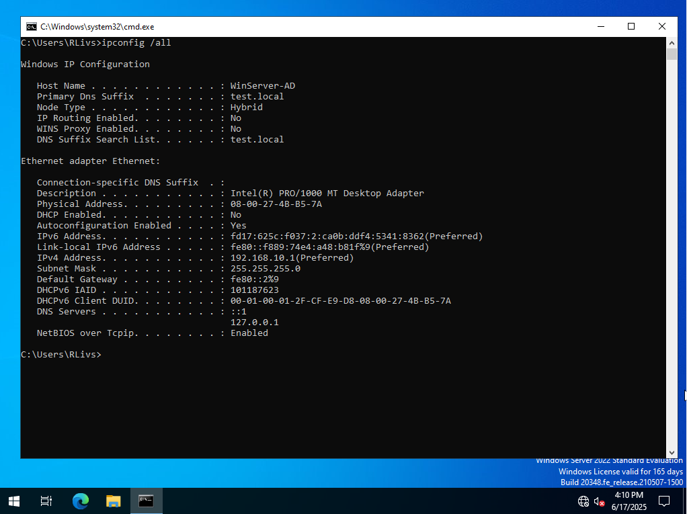
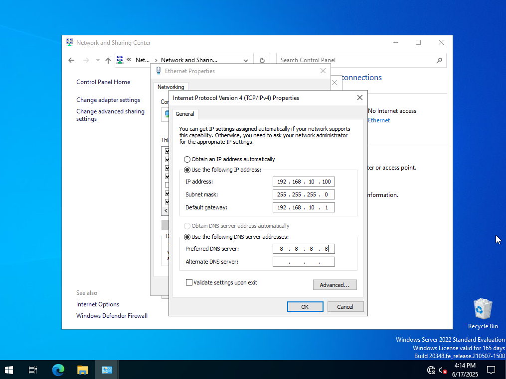
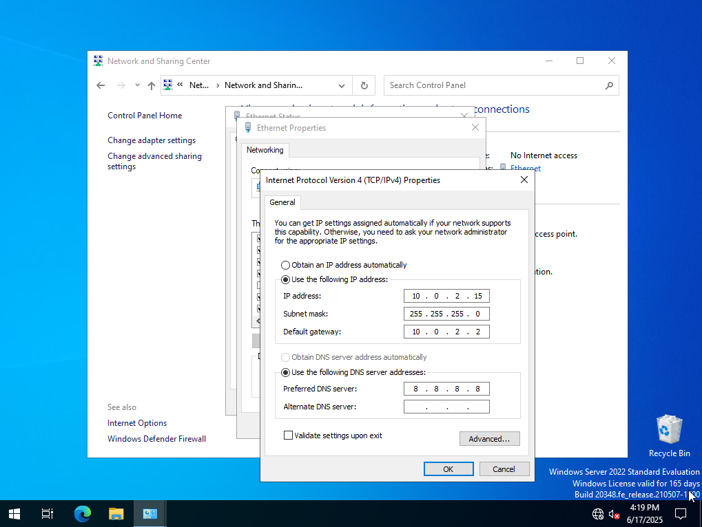
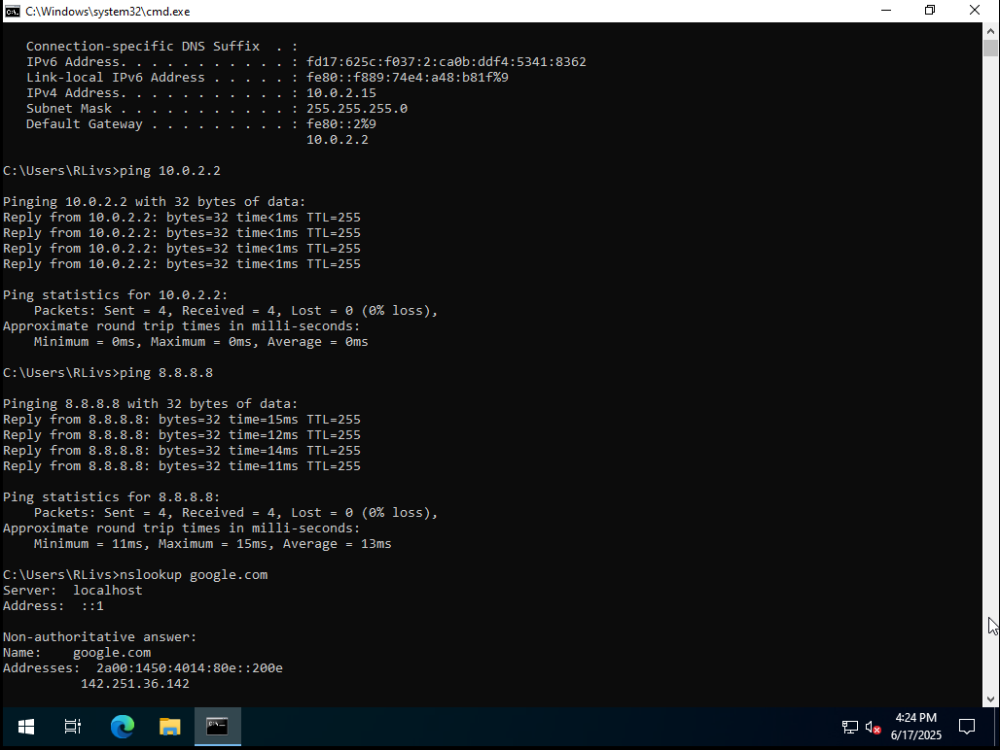

# Lab 01 — Static IP Configuration in Windows (VirtualBox NAT)

## Goal
Learn how to manually configure a static IP address in Windows, verify network parameters (IP, subnet mask, gateway, DNS), and test connectivity using `ping` and `nslookup`.

---

## Steps and Results

| Step | Description | Screenshot |
|------|-------------|------------|
| 1 | Check current network configuration using `ipconfig /all`. This shows the system is using automatic IP assignment (DHCP). |  |
| 2 | Set a static IP manually with incorrect gateway `192.168.10.1` (not valid in VirtualBox NAT). Internet connectivity fails. |  |
| 3 | Correct the IP configuration using the proper VirtualBox NAT range: IP `10.0.2.15`, Gateway `10.0.2.2`. |  |
| 4 | Test network: `ping` to gateway and to Google DNS (`8.8.8.8`) succeed. DNS resolution with `nslookup google.com` also works. |  |

---

## ✅ What I Learned

- How to view network settings using `ipconfig /all`
- How to set a static IP address in Windows
- How VirtualBox NAT works (`10.0.2.0/24` network with gateway `10.0.2.2`)
- How to test connectivity using `ping`
- How to check DNS resolution with `nslookup`

---

## 💡 Notes

- `192.168.10.1` was used initially as a hypothetical gateway, but it didn’t work in the NAT setup. This helped understand the importance of matching static IP configuration with the actual virtual network.
- The correct configuration in VirtualBox NAT uses `10.0.2.15` for IP and `10.0.2.2` as gateway.
